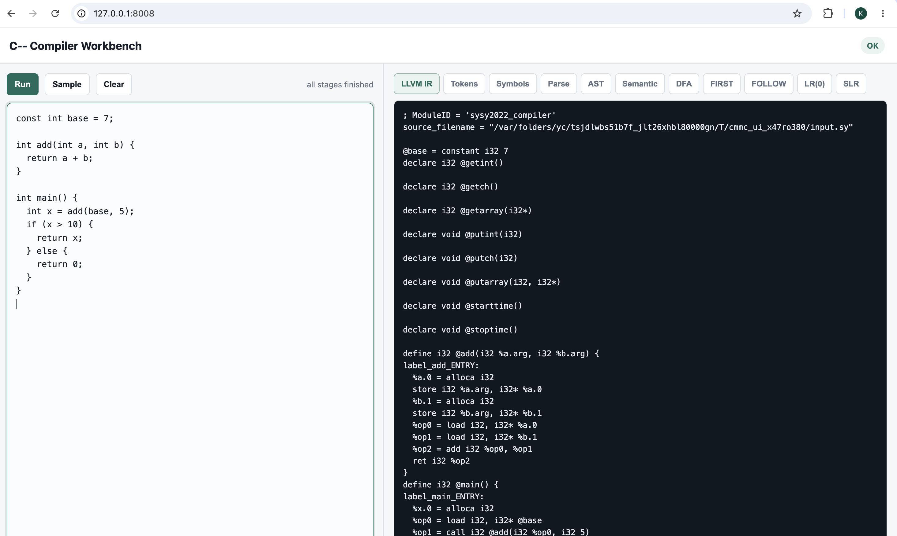

# Minecompiler 项目开发报告

**项目仓库已发布到GitHub：https://github.com/DINGBROK423/Minecompiler**

## 1. 项目概述

本项目实现了一个面向 C-- 语言的编译器前端，输入 `.sy` 源程序，经过词法分析、SLR 语法分析、AST 构造、语义分析和中间代码生成，最终输出 LLVM IR 文本文件 `.ll`。

三项核心任务均已完成：

| 项目要求 | 本项目实现 |
| --- | --- |
| 基于自动机理论实现词法分析器，输出单词二元属性并填写符号表 | `Lexer` 通过 NFA、DFA、最小化 DFA 完成扫描，输出 token 序列和标识符符号表 |
| 使用 SLR 算法实现语法分析器，输出规约过程并能报告语法错误 | `GrammarAnalyzer` 自动计算 FIRST/FOLLOW、LR(0) 项目集族和 SLR 表，`SLRParser` 输出 move/reduction/accept/error 过程 |
| 衔接 `compiler_ir` 中端库，遍历语法树生成 LLVM IR | `IRGenerator` 遍历 AST，调用 `compiler_ir` 中端库构造 Module、Function、BasicBlock、Instruction，并输出 `.ll` |

编译流程如下：

```text
.sy source
  -> Lexer: NFA / DFA / minimized DFA
  -> TokenStream + lexical symbol table
  -> Grammar Engine: FIRST / FOLLOW + LR(0) items + SLR table
  -> SLR Parser: move / reduction / accept / error trace
  -> AST
  -> Semantic Analyzer: scopes / types / functions / const
  -> IR Generator
  -> LLVM IR .ll
```

## 2. 工程结构

项目主体位于 `lab_final/compiler`：

```text
include/
  token.h       Token、SourceLoc、Diagnostic 等基础结构
  lexer.h       NFA、DFA、Lexer 接口
  grammar.h     Production、FIRST/FOLLOW、LR(0)、SLRTable、SLRParser
  ast.h         AST 结点、文本输出和 DOT 输出
  semantic.h    作用域符号表和语义检查
  ir.h          IR 生成接口
src/
  lexer.cpp     自动机构造式词法分析器
  grammar.cpp   文法、FIRST/FOLLOW、LR(0) 项目集和 SLR 表
  parser.cpp    SLR 分析、规约 trace、AST 构造
  ast.cpp       AST 缩进树和 DOT 导出
  semantic.cpp  语义检查
  ir.cpp        compiler_ir 后端适配与 float fallback
  main.cpp      CLI 驱动和阶段产物输出
tests/
  lexer/        词法测试
  valid/        正确程序语法、AST、语义测试
  invalid/      错误程序测试
  ir/           中间代码生成测试
docs/
  设计方案.md
  项目测试报告.md
  项目开发报告.md
external/
  compiler_ir   compiler_ir 中端库，作为 Git submodule 接入
ui/
  server.py
  index.html
```

项目支持 Makefile 和 CMake 两种构建方式。`external/compiler_ir` 通过 Git submodule 引入，首次克隆后需要执行：

```bash
git submodule update --init --recursive
```

## 3. 词法分析器设计

### 3.1 词法单元定义

词法分析器支持 C-- 语言规范规定的单词类型：

- 关键字 `KW`：`int`、`void`、`return`、`const`、`main`、`float`、`if`、`else`，不区分大小写。
- 运算符 `OP`：`+`、`-`、`*`、`/`、`%`、`=`、`>`、`<`、`==`、`<=`、`>=`、`!=`、`&&`、`||`，并支持单目 `!`。
- 界符 `SE`：`(`、`)`、`{`、`}`、`;`、`,`。
- 标识符 `IDN`：由字母、数字、下划线组成，且不以数字开头。
- 整数 `INT`：数字串。
- 浮点数 `FLOAT`：包含一个小数点的数字串。

Token 数据结构为：

```cpp
struct Token {
    TokenKind kind;
    int code;
    std::string lexeme;
    SourceLoc loc;
};
```

其中 `kind` 表示 token 种别，`code` 表示关键字、运算符和界符编号，`lexeme` 保存源码文本，`loc` 保存行列位置。

### 3.2 NFA 构造

`Lexer` 内部为每类 token 构造 NFA 片段：

```cpp
struct NFAState {
    int id;
    std::map<int, std::set<int>> edges;
    std::set<int> eps;
    int accept_priority;
    std::string accept_name;
};
```

实现中提供了基础构造函数：

- `literal_nfa(s)`：为固定字符串构造链式 NFA，例如关键字、运算符和界符。
- `charset_nfa(chars)`：为字符集合构造 NFA，例如字母、数字。
- `concat(a, b)`：连接两个 NFA 片段。
- `star(a)`：构造 Kleene 闭包。
- `plus(a)`：构造正闭包。
- `add_token_nfa(name, priority, frag)`：把 token 片段接到总起点上，并设置接受优先级。

所有 token 片段通过 epsilon 边连接到统一起始状态。若多个规则同时接受同一串，使用 `accept_priority` 选择优先级最高的 token，保证关键字优先于普通标识符。

### 3.3 DFA 确定化

确定化采用子集构造算法。核心函数包括：

- `epsilon_closure(states)`：求 NFA 状态集合的 epsilon 闭包。
- `move_set(states, c)`：求状态集合在字符 `c` 上可达的状态集合。
- `build_dfa()`：从 NFA 起始闭包开始，逐步枚举字符转移，生成 DFA 状态。

伪代码如下：

```text
start = epsilon_closure({nfa_start})
create DFA state for start
queue.push(start)

while queue not empty:
    S = queue.pop()
    for each input character c:
        T = epsilon_closure(move(S, c))
        if T is not empty:
            if T has no DFA state:
                create new DFA state
                queue.push(T)
            add transition S --c--> T
```

每个 DFA 状态保存它对应的 NFA 状态集合中优先级最高的接受规则。

### 3.4 DFA 最小化

最小化采用等价类划分思想。初始时按照接受类型和非接受类型划分状态，再根据每个状态在所有字符上的转移目标等价类不断细分，直到划分稳定。

伪代码如下：

```text
partition = states grouped by accept token kind
repeat:
    new_partition = {}
    for each group in partition:
        split group by transition signature
    if new_partition == partition:
        break
    partition = new_partition
rebuild minimized DFA from partition
```

最小化后的 DFA 可通过命令导出为 CSV：

```bash
./cmmc --dump-dfa tests/lexer/mixed.sy
```

### 3.5 扫描算法与错误恢复

扫描阶段从当前输入位置出发，沿 DFA 转移进行最长匹配，记录最后一次到达接受状态的位置和 token 类型。若最终存在接受状态，则输出该 token；若不存在接受状态，则输出 `ERROR` 诊断并跳过当前非法字符。

处理策略：

- 空白字符跳过。
- `//` 单行注释跳过。
- 关键字大小写不敏感，输出时仍保留源码 lexeme。
- 标识符写入词法符号表，记录首次出现位置和出现次数。
- 非法字符报告 `lexer:line:col: illegal character ...`，并继续扫描。

### 3.6 词法输出格式

单词符号序列输出格式为：

```text
[待测代码中的单词符号] [TAB] <[单词符号种别],[单词符号内容]>
```

示例：

```text
int    <KW,1>
a      <IDN,a>
=      <OP,11>
10     <INT,10>
;      <SE,24>
```

对应命令：

```bash
./cmmc --lex input.sy
./cmmc --symtab input.sy
```

## 4. SLR 语法分析器设计

### 4.1 文法设计

项目以内置 BNF 文法描述 C-- 语言，核心产生式覆盖：

- 变量声明与初始化。
- `const` 常量声明。
- 函数定义、参数和调用。
- 赋值语句、空语句、块语句、`if/else`、`return`。
- 一元、二元和复合表达式。
- 比较表达式和逻辑表达式。

为适配 SLR 分析和工程实现，文法做了必要改写：

- 使用 `matchedStmt / unmatchedStmt` 消除 dangling else 二义性。
- 将 EBNF 中的 `*`、`?` 改写为普通 BNF，例如 `funcFParamsOpt`、`funcFParamsTail`。
- 函数名支持 `Ident` 和关键字 `main`。
- 默认核心 `int/void` 子集保持稳定，同时保留 `float` 函数返回值和普通表达式中比较/逻辑运算的扩展能力。

产生式由 `Production` 表示：

```cpp
struct Production {
    int id;
    std::string lhs;
    std::vector<std::string> rhs;
};
```

### 4.2 FIRST 集合计算

FIRST 集合采用迭代不动点算法。终结符的 FIRST 集为自身，非终结符初始为空；不断扫描产生式 `A -> X1 X2 ... Xn`，将 `FIRST(Xi)` 中非空串符号加入 `FIRST(A)`，若前缀均可为空，则加入 `$`。

伪代码：

```text
for terminal t:
    FIRST[t] = {t}
for nonterminal A:
    FIRST[A] = {}

repeat until no change:
    for each production A -> X1 X2 ... Xn:
        nullable_prefix = true
        for Xi in RHS:
            FIRST[A] += FIRST[Xi] - {$}
            if $ not in FIRST[Xi]:
                nullable_prefix = false
                break
        if nullable_prefix:
            FIRST[A] += {$}
```

### 4.3 FOLLOW 集合计算

FOLLOW 集合同样使用不动点迭代。开始符号 `Program` 的 FOLLOW 集加入 `EOF`。对每个产生式 `A -> alpha B beta`，将 `FIRST(beta)` 中非空符号加入 `FOLLOW(B)`；若 `beta` 可为空，则将 `FOLLOW(A)` 加入 `FOLLOW(B)`。

伪代码：

```text
FOLLOW[start] = {EOF}

repeat until no change:
    for each production A -> X1 X2 ... Xn:
        for each nonterminal Xi:
            beta = symbols after Xi
            FOLLOW[Xi] += FIRST(beta) - {$}
            if beta is nullable:
                FOLLOW[Xi] += FOLLOW[A]
```

FIRST/FOLLOW 可通过以下命令导出：

```bash
./cmmc --dump-first input.sy
./cmmc --dump-follow input.sy
./cmmc --dump-first-follow input.sy
```

### 4.4 LR(0) 项目集规范族

LR(0) 项目由产生式编号和点位置组成：

```cpp
struct Item {
    int production;
    int dot;
};
```

`closure(I)` 算法：

```text
closure(I):
    result = I
    repeat until no change:
        for each item A -> alpha . B beta in result:
            for each production B -> gamma:
                add B -> . gamma to result
    return result
```

`goto(I, X)` 算法：

```text
goto(I, X):
    moved = {}
    for each item A -> alpha . X beta in I:
        add A -> alpha X . beta to moved
    return closure(moved)
```

项目集规范族构造流程：

```text
I0 = closure({S' -> . Program})
states = {I0}
queue = [I0]

while queue not empty:
    I = queue.pop()
    for each grammar symbol X:
        J = goto(I, X)
        if J is not empty:
            if J is new:
                add J to states and queue
            record transition I --X--> J
```

LR(0) 项目集可通过以下命令导出：

```bash
./cmmc --dump-lr0 input.sy
```

### 4.5 SLR 分析表构造

SLR 表分为 ACTION 和 GOTO：

- 若存在项目 `A -> alpha . a beta`，其中 `a` 为终结符，则设置 `ACTION[i, a] = shift j`。
- 若存在项目 `A -> alpha .` 且 `A` 不是增广开始符，则对每个 `a in FOLLOW(A)` 设置 `ACTION[i, a] = reduce A -> alpha`。
- 若存在项目 `S' -> Program .`，设置 `ACTION[i, EOF] = accept`。
- 若存在 `goto(Ii, A) = Ij`，其中 `A` 为非终结符，则设置 `GOTO[i, A] = j`。

伪代码：

```text
for each state Ii:
    for each transition Ii --X--> Ij:
        if X is terminal:
            ACTION[i, X] = shift j
        else:
            GOTO[i, X] = j

    for each completed item A -> alpha . in Ii:
        if A == S':
            ACTION[i, EOF] = accept
        else:
            for each a in FOLLOW(A):
                ACTION[i, a] = reduce production(A -> alpha)
```

SLR 表可通过 CSV 形式导出：

```bash
./cmmc --dump-slr input.sy
```

### 4.6 SLR 分析过程和 AST 构造

语法分析器维护状态栈和 AST 结点栈：

```text
state_stack = [0]
node_stack = []
lookahead = first token

loop:
    state = top(state_stack)
    action = ACTION[state, lookahead]

    if action is shift:
        push token leaf node
        push target state
        read next token

    else if action is reduce A -> beta:
        pop |beta| states and |beta| AST nodes
        create AstNode(A)
        attach popped nodes as children
        push AstNode(A)
        push GOTO[top(state_stack), A]

    else if action is accept:
        return AST root

    else:
        report parser error
```

每次 shift、reduce、accept 或 error 都会写入规约 trace。输出格式为：

```text
[序号] [TAB] [栈顶符号]#[面临输入符号] [TAB] [执行动作]
```

本项目 reduction 行额外输出使用的产生式编号，便于调试和对应 SLR 表：

```text
1    state0#int       reduction(2)
2    compUnit#int     move
...
```

命令：

```bash
./cmmc --parse input.sy
./cmmc --ast input.sy
./cmmc --ast-dot input.sy
```

## 5. AST 存储与遍历

### 5.1 AST 结点结构

AST 使用共享指针树结构：

```cpp
struct AstNode {
    std::string kind;
    std::string text;
    SourceLoc loc;
    std::vector<std::shared_ptr<AstNode>> children;
};
```

字段说明：

- `kind`：结点类型，例如 `funcDef`、`stmt`、`addExp`、`Ident`。
- `text`：叶子结点文本，例如变量名、关键字、常量值。
- `loc`：源码行列位置，用于诊断。
- `children`：子结点列表。

### 5.2 AST 构造策略

AST 在 SLR 规约时同步构造：

- shift token 时创建叶子结点。
- reduce `A -> beta` 时弹出 `|beta|` 个子结点，反转后挂到新建的 `A` 结点下。
- accept 时结点栈顶即为完整 AST。

这种方式不需要额外遍历 parse trace 重建语法树，保证 AST 与 SLR 规约过程一致。

### 5.3 AST 输出

项目提供两种 AST 输出：

1. 缩进文本树，便于报告和调试查看。
2. Graphviz DOT 格式，便于生成可视化语法树。

命令：

```bash
./cmmc --ast tests/valid/if_else.sy
./cmmc --ast-dot tests/valid/if_else.sy
```

## 6. 语义分析设计

语义分析在 AST 基础上完成，主要使用作用域栈和符号表。

符号结构：

```cpp
struct SemanticSymbol {
    std::string name;
    std::string type;
    bool is_const;
    bool is_function;
    std::vector<std::string> params;
    SourceLoc loc;
};
```

### 6.1 作用域管理

语义分析器维护：

```cpp
std::vector<std::map<std::string, SemanticSymbol>> scopes_;
std::vector<std::string> scope_names_;
```

进入函数或块时调用 `enter_scope`，离开时调用 `leave_scope`。声明符号时只检查当前作用域是否重名；使用符号时从当前作用域向外层逐层查找。

### 6.2 两阶段函数处理

为了允许函数先调用后定义，语义分析分两阶段：

1. 预声明所有函数，将函数名、返回类型、参数类型写入全局作用域。
2. 遍历 AST，检查声明、语句、表达式和函数体。

伪代码：

```text
analyze(root):
    enter global scope
    predeclare all funcDef
    visit(root)
    output symbol table and diagnostics
```

### 6.3 检查内容

语义分析覆盖：

- 同一作用域重定义。
- 未定义变量使用。
- 函数名被当作变量使用。
- `const` 变量重新赋值。
- `const` 变量必须初始化。
- 函数实参数量检查。
- 函数实参与形参类型兼容检查。
- `return` 表达式与函数返回类型匹配。
- 非 `void` 函数中的 `return;` 空返回检查，以及无显式返回时的诊断。

类型兼容规则：

```text
same type        allowed
int -> float     allowed
float -> int     rejected
```

语义分析输出包括符号表和诊断信息：

```bash
./cmmc --semantic input.sy
```

## 7. 中间代码生成设计

### 7.1 总体设计

中间代码生成器位于 `src/ir.cpp`，入口为：

```cpp
IRResult IRGenerator::generate(const AstPtr& root, const std::string& source_name);
```

项目采用双后端设计：

1. `int/void` 核心子集使用提供的 `compiler_ir` 中端库真实构造 LLVM IR。
2. 含 `float` 的扩展示例使用文本 fallback 后端输出 LLVM IR，因为 `compiler_ir` 中端库对浮点常量和浮点二元指令封装不完整。

两条路径共享同一套词法、语法、AST 和语义分析结果，对外命令一致：

```bash
./cmmc --ir input.sy -o output.ll
```

### 7.2 调用 compiler_ir 的主路径

`CompilerIRBackend` 封装了对中端库的调用。核心成员包括：

```cpp
Module module_;
std::unique_ptr<IRBuilder> builder_;
Function* current_function_;
Type* current_return_type_;
std::map<std::string, Function*> functions_;
std::vector<std::map<std::string, MiddleBinding>> scopes_;
```

使用到的中端接口包括：

- `Module`：表示整个编译单元。
- `FunctionType / Function`：创建函数声明和定义。
- `BasicBlock`：创建入口块、then/else/merge 块。
- `IRBuilder`：创建 `alloca`、`store`、`load`、算术指令、比较指令、跳转和返回指令。
- `GlobalVariable`：创建全局变量和全局常量。
- `ConstantInt`：创建整型常量。

### 7.3 IR 生成流程

整体流程：

```text
generate(root):
    create Module
    enter global scope
    declare runtime functions
    predeclare user functions
    emit global declarations
    emit function definitions
    print Module as LLVM IR
```

运行时函数声明包括：

```llvm
declare i32 @getint()
declare i32 @getch()
declare i32 @getarray(i32*)
declare void @putint(i32)
declare void @putch(i32)
declare void @putarray(i32, i32*)
declare void @starttime()
declare void @stoptime()
```

### 7.4 全局变量和常量生成

全局声明处理伪代码：

```text
emit_global_decl(decl):
    is_const = decl is constDecl
    for each constDef/varDef:
        name = Ident
        init = evaluate initVal/constInitVal
        gv = GlobalVariable::create(name, module, type, is_const, init)
        bind name to gv in global scope
        if is_const:
            record constant value for later const expression evaluation
```

示例：

```c
const int a = 3;
const int b = a + 1;
```

生成：

```llvm
@a = constant i32 3
@b = constant i32 4
```

### 7.5 函数生成

函数生成流程：

```text
emit_function(funcDef):
    find predeclared Function
    create entry BasicBlock
    set IRBuilder insertion point
    enter function scope
    for each parameter:
        set argument name
        alloca local slot
        store argument into slot
        bind parameter symbol
    emit function block
    if current block has no terminator:
        emit default return
    leave function scope
```

参数通过 `alloca + store` 进入局部符号表，后续表达式使用时通过 `load` 读取。

### 7.6 局部声明与赋值

局部变量声明：

```text
emit_local_decl(decl):
    for each varDef/constDef:
        ptr = builder.create_alloca(type)
        bind name -> ptr
        if has initializer:
            value = emit_expr(init)
            builder.create_store(value, ptr)
```

赋值语句：

```text
emit_stmt(lVal = exp):
    binding = lookup(lVal)
    value = emit_expr(exp)
    builder.create_store(value, binding.ptr)
```

### 7.7 表达式生成

表达式生成采用递归遍历 AST：

```text
emit_expr(expr):
    if expr is IntConst:
        return ConstantInt
    if expr is lVal:
        return load(lookup(name).ptr)
    if expr is function call:
        emit actual arguments
        return create_call(function, args)
    if expr is unary op:
        emit child
        generate neg/not
    if expr is binary op:
        lhs = emit_expr(left)
        rhs = emit_expr(right)
        generate add/sub/mul/div/rem/cmp/logical op
```

二元运算映射：

| 源语言运算 | IRBuilder 调用 |
| --- | --- |
| `+` | `create_iadd` |
| `-` | `create_isub` |
| `*` | `create_imul` |
| `/` | `create_isdiv` |
| `%` | `create_irem` |
| `< > <= >= == !=` | `create_icmp_*` + `create_zext` |
| `&& ||` | 布尔比较后组合并扩展为 `i32` |

### 7.8 if/else 控制流生成

条件语句生成基本块：

```text
emit_if(stmt):
    cond_value = emit_expr(cond)
    cond_bool = as_bool(cond_value)
    then_bb = BasicBlock::create(...)
    else_bb = BasicBlock::create(...) if has else
    merge_bb = BasicBlock::create(...)
    builder.create_cond_br(cond_bool, then_bb, else_bb/merge_bb)

    set insert point to then_bb
    emit then stmt
    if no terminator:
        br merge_bb

    if has else:
        set insert point to else_bb
        emit else stmt
        if no terminator:
            br merge_bb

    set insert point to merge_bb
```

如果 then 和 else 分支都已经 `return`，则不再生成多余 merge 跳转。

### 7.9 float fallback 后端

由于 `compiler_ir` 中端库主要覆盖整数 IR，本项目对含 `float` 的程序使用文本后端补充支持：

- 全局 `float` 变量和 `const float` 初始化。
- 浮点常量表达式求值。
- 局部 const 处理。
- `sitofp` 和 `fptosi` 类型转换。
- `fadd`、`fsub`、`fmul`、`fdiv` 浮点运算。
- `fcmp` 浮点比较。
- 浮点函数参数、返回值和调用。

该扩展不影响 `int/void` 核心主路径。

## 8. 命令行接口与编译步骤

### 8.1 构建步骤

首次获取仓库后：

```bash
git submodule update --init --recursive
```

Makefile 构建：

```bash
make
```

CMake 构建：

```bash
cmake -S . -B build/cmake
cmake --build build/cmake
```

### 8.2 各阶段运行命令

词法分析：

```bash
./cmmc --lex tests/lexer/mixed.sy
./cmmc --symtab tests/lexer/mixed.sy
```

语法分析：

```bash
./cmmc --parse tests/valid/basic.sy
```

AST 输出：

```bash
./cmmc --ast tests/valid/if_else.sy
./cmmc --ast-dot tests/valid/if_else.sy
```

语义分析：

```bash
./cmmc --semantic tests/invalid/semantic.sy
```

中间代码生成：

```bash
./cmmc --ir tests/ir/simple.sy -o simple.ll
```

自动机构造和 SLR 表导出：

```bash
./cmmc --dump-dfa tests/lexer/mixed.sy
./cmmc --dump-first tests/valid/basic.sy
./cmmc --dump-follow tests/valid/basic.sy
./cmmc --dump-lr0 tests/valid/basic.sy
./cmmc --dump-slr tests/valid/basic.sy
```

一次性生成全部展示材料：

```bash
./cmmc --dump-all tests/valid/functions.sy -o build/out
make demo
```

### 8.3 输出产物

`--dump-all` 会输出：

| 文件 | 内容 |
| --- | --- |
| `.tokens` | 词法 token 序列 |
| `.symtab` | 词法标识符符号表 |
| `.dfa.csv` | 最小化 DFA 转移表 |
| `.first` | FIRST 集合 |
| `.follow` | FOLLOW 集合 |
| `.lr0` | LR(0) 项目集规范族 |
| `.slr.csv` | SLR ACTION/GOTO 表 |
| `.parse` | SLR 移进、规约、接受或错误过程 |
| `.ast` | AST 缩进树 |
| `.ast.dot` | AST DOT 可视化文件 |
| `.semantic.log` | 语义符号表和错误信息 |
| `.ll` | LLVM IR |

## 9. 测试设计与结果

测试分为四类：

```text
tests/lexer    词法分类测试和综合测试
tests/valid    正确程序测试
tests/invalid  错误程序测试
tests/ir       LLVM IR 生成测试
```

自动化测试命令：

```bash
make test
make cmake-test
```

测试脚本覆盖：

- 词法：关键字大小写、注释、浮点数、非法字符恢复。
- 语法：变量/常量、函数、参数、表达式、if/else、dangling else、规约 trace。
- AST：语法树文本输出和 DOT 输出。
- 语义：未定义变量、const 赋值、函数参数数量错误、嵌套函数调用、return 类型错误。
- IR：全局/局部变量、常量表达式、函数调用、if/else、float fallback。

若环境中存在 `clang`，测试脚本会进一步执行：

```bash
clang -c -x ir output.ll
```

以验证生成的 LLVM IR 能被工具链接受。

详细截图和逐项分析见：

```text
docs/项目测试报告.md
```

## 10. 创新点与工程增强

1. 自动化 SLR 构造：从内置文法自动生成 FIRST/FOLLOW、LR(0) 项目集和 SLR ACTION/GOTO 表。
2. 编译过程可解释：DFA、FIRST、FOLLOW、LR(0)、SLR 表、parse trace、AST、语义日志和 IR 均可导出。
3. 分层诊断：词法、语法和语义阶段均带阶段名、行列位置和错误信息。
4. 测试驱动：每个阶段都有对应测试，并对 IR 执行 LLVM 工具校验。
5. 中端适配层：将对 `compiler_ir` 的调用集中封装在 IR 后端中，避免 AST 遍历逻辑散落。
6. Web UI 展示：提供本地页面，可一键运行 `--dump-all` 并查看各阶段产物，便于答辩演示。

启动 UI：

```bash
make ui
```

访问：

```text
http://127.0.0.1:8008
```
前端展示


## 11. 功能实现对应关系

| 功能目标 | 对应实现 |
| --- | --- |
| 实现有限自动机确定化和最小化 | `Lexer::build_nfa`、`Lexer::build_dfa`、`Lexer::minimize_dfa` |
| 输出单词二元属性 | `Lexer::format_tokens` |
| 填写符号表 | `Lexer::format_symbol_table` |
| 构造 LR(0) 项目集规范族 | `GrammarAnalyzer::closure`、`GrammarAnalyzer::go_to`、`GrammarAnalyzer::build` |
| 构造 FIRST/FOLLOW 集合 | `compute_first`、`compute_follow` |
| 构造 SLR 分析表 | `GrammarAnalyzer::build`、`dump_slr_csv` |
| 输出规约过程 | `SLRParser::parse` |
| 输出语法错误信息 | `SLRParser::parse` 中 parser diagnostic |
| 遍历语法树调用中端 | `CompilerIRBackend` 中 `emit_*` 系列函数 |
| 输出 LLVM IR `.ll` | `IRGenerator::generate` |

## 12. 小组分工

组长：王一丁
- 负责整体架构设计与技术路线确定
- 完成编译器主流程集成：Lexer -> Parser -> AST -> Semantic -> IR
- 实现 IR 生成模块与 `compiler_ir` 中端库适配
- 负责 Makefile/CMake 工程化构建、CLI 设计、最终联调与验收
- 统筹测试体系和答辩材料
- 参与 README、开发报告和 PPT 整理

组员 A：王子轩
- 负责词法规则整理、Token 编号核对
- 参与 NFA/DFA/min-DFA 输出验证
- 负责词法测试样例和报告词法部分
- 参与 README、开发报告和 PPT 整理

组员 B：王然驰
- 负责 C-- 文法整理、SLR 分析表核对
- 参与 FIRST/FOLLOW、LR(0)、规约过程验证
- 负责语法测试样例和报告语法部分
- 参与 README、开发报告和 PPT 整理

组员 C：薛强
- 负责语义测试、错误样例设计和结果验证
- 负责测试报告、运行截图和 UI 展示材料
- 参与 README、开发报告和 PPT 整理

## 13. 总结

本项目完成了 C-- 编译器前端的完整实现。词法阶段基于自动机构造和最小化，语法阶段自动构造 SLR 分析表并输出规约过程，AST 构造与语义分析为 IR 生成提供结构和类型保障，中间代码阶段通过 `compiler_ir` 中端库输出 LLVM IR。

项目完成了编译器前端的核心功能，并补充了 DFA/SLR/AST 可视化导出、语义检查、LLVM IR 校验、float 扩展 fallback 和 Web UI 展示。测试结果表明，当前实现能够正确处理合法程序、发现典型错误程序，并生成可被 LLVM 工具接受的中间代码。
