# Minecompiler 项目测试报告

## 1. 测试概述

本测试报告汇总了项目中 `tests/lexer`、`tests/valid`、`tests/invalid` 和 `tests/ir` 四类测试结果，覆盖词法分析、SLR 语法分析、AST 构造、语义分析和 LLVM IR 生成等核心阶段。

测试入口包括：

```bash
make test
make cmake-test
make demo
```

当前自动化测试已全部通过。若本机存在 `clang`，测试脚本会进一步对生成的 `.ll` 文件执行 `clang -c -x ir`，用于验证 LLVM IR 的类型和语法正确性。

## 2. 词法分析测试

### 2.1 测试结果总览

| 测试文件 | 测试内容 | 词法分析结果 |
| --- | --- | --- |
| `tests/lexer/sorted_test.sy` | 分类测试关键字、标识符、运算符、界符、整数、浮点数和非法字符 | 符合预期 |
| `tests/lexer/mixed.sy` | 综合测试大小写关键字、注释、表达式、浮点数和错误恢复 | 符合预期 |

### 2.2 分类测试：`sorted_test.sy`

测试命令：

```bash
./cmmc --lex tests/lexer/sorted_test.sy
```

该用例按类别集中验证所有主要词法单元，包括关键字、标识符、运算符、界符、整数常量、浮点常量和非法字符。

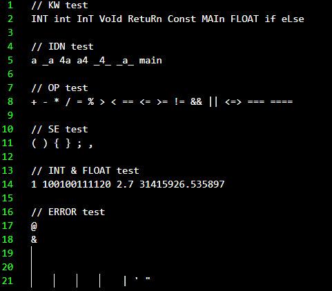

关键字测试结果如下。词法分析器能够正确识别所有关键字，并且对大小写不同的关键字执行一致处理，编号与 C-- 词法编号匹配。

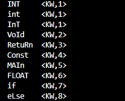

标识符测试结果如下。`a`、`_a`、`a4`、`_4_`、`_a_` 等合法标识符均被正确识别；错误形式 `4a` 没有被整体误判为标识符；关键字也不会被错误归类为标识符。

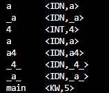

运算符测试结果如下。标准运算符均被正确识别并映射到对应编号。对于 `<=>`、`===`、`====` 等非标准多字符符号，词法分析器按照最长匹配原则合理切分，例如 `<=>` 被切分为 `<=` 和 `>`，`===` 被切分为 `==` 和 `=`。

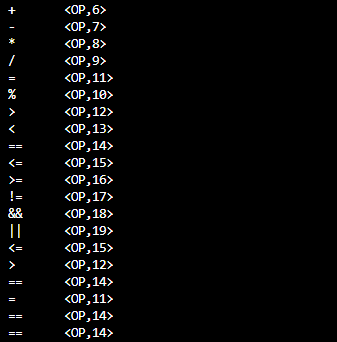

界符测试结果如下。圆括号、花括号、逗号、分号等界符均能被正确识别，并映射到项目内置编号。

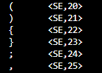

整数和浮点数测试结果如下。整数常量输出为 `<INT,数值>`，浮点数常量输出为 `<FLOAT,数值>`，数值文本保持原样，没有把带小数点的数字错误拆分。

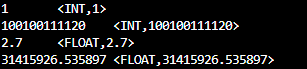

错误符号测试结果如下。`@`、`&`、`|`、`'`、`"` 等语言定义之外的字符均被识别为错误符号，并输出错误类型及行列位置。扫描过程没有因非法字符中断，具备错误恢复能力。

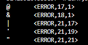

### 2.3 综合测试：`mixed.sy`

测试命令：

```bash
./cmmc --lex tests/lexer/mixed.sy
```

该用例模拟一段正常程序，并额外加入大小写混合关键字、单行注释、浮点数、复合运算符和非法字符，用于验证词法分析器在真实程序场景下的综合能力。

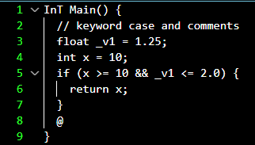

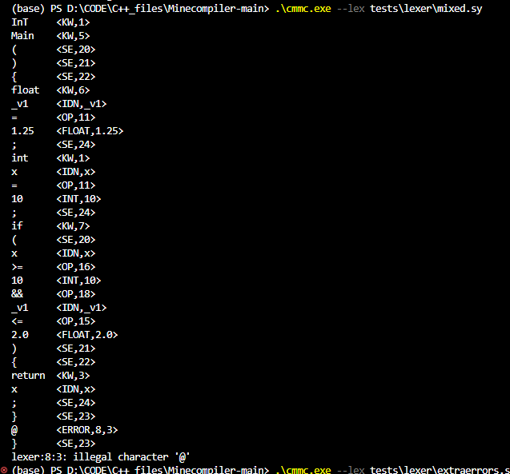

测试结果表明，`InT`、`Main` 能够被识别为关键字，`// keyword case and comments` 被完整忽略，`_v1` 和 `x` 被识别为标识符，`>=`、`<=`、`&&` 等复合运算符按照最长匹配原则整体识别。整数 `10`、浮点数 `1.25` 和 `2.0` 均识别正确。文件末尾故意加入的非法字符 `@` 被输出为错误 token，并给出准确行列位置。

### 2.4 词法测试结论

词法分析器对合法词法单元的识别完整准确，对非标准多字符符号能够按照最长匹配原则合理拆分，对非法字符能够定位并继续扫描。分类测试与综合测试均符合预期，说明词法分析阶段实现正确且稳定。

## 3. Valid 正确程序测试

### 3.1 测试结果总览

| 测试文件 | SLR 语法测试 | AST 测试 | 语义测试 |
| --- | --- | --- | --- |
| `tests/valid/basic.sy` | 通过 | 正确 | 正确 |
| `tests/valid/if_else.sy` | 通过 | 正确 | 正确 |
| `tests/valid/dangling_else.sy` | 通过 | 正确 | 正确 |
| `tests/valid/float_mix.sy` | 通过 | 正确 | 正确 |
| `tests/valid/functions.sy` | 通过 | 正确 | 正确 |
| `tests/valid/nested_calls.sy` | 通过 | 正确 | 正确 |

### 3.2 `basic.sy`：基础功能测试

测试目标是验证全局变量、局部变量、变量赋值、整数四则运算和 `return` 语句等基础语法与语义。

SLR 分析能够从表达式逐级归约为 `exp`、`stmt`、`block`、`funcDef`、`compUnit`，最终 `accept`。AST 中正确生成 `Program`、`compUnit`、`decl`、`funcDef`、`block` 等节点，结构与源码一致。语义分析中符号表输出正确，没有重定义、未定义使用或类型不匹配。

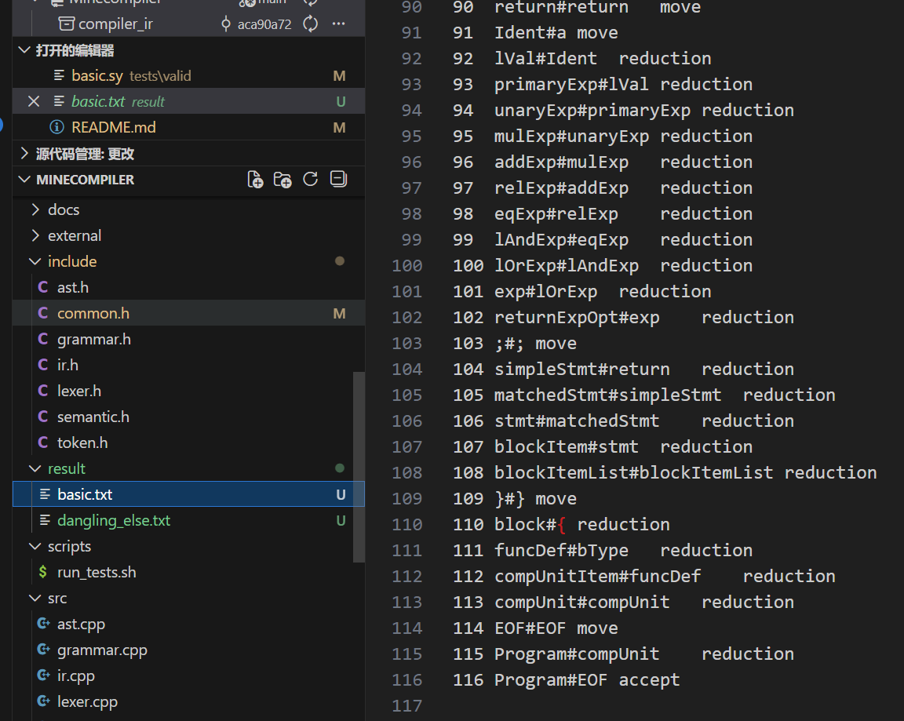

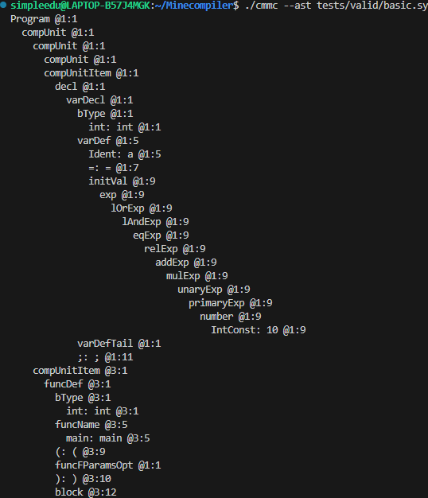

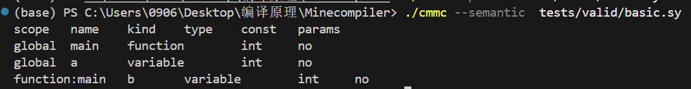

### 3.3 `if_else.sy`：分支控制流测试

测试目标是验证 `if/else` 分支结构、条件表达式和控制流跳转逻辑。

语法分析能够正常归约嵌套分支结构，AST 中 `if`、`else`、`cond`、`stmt` 等节点层次清晰，语义分析确认函数和局部变量作用域合法，条件表达式类型检查通过。

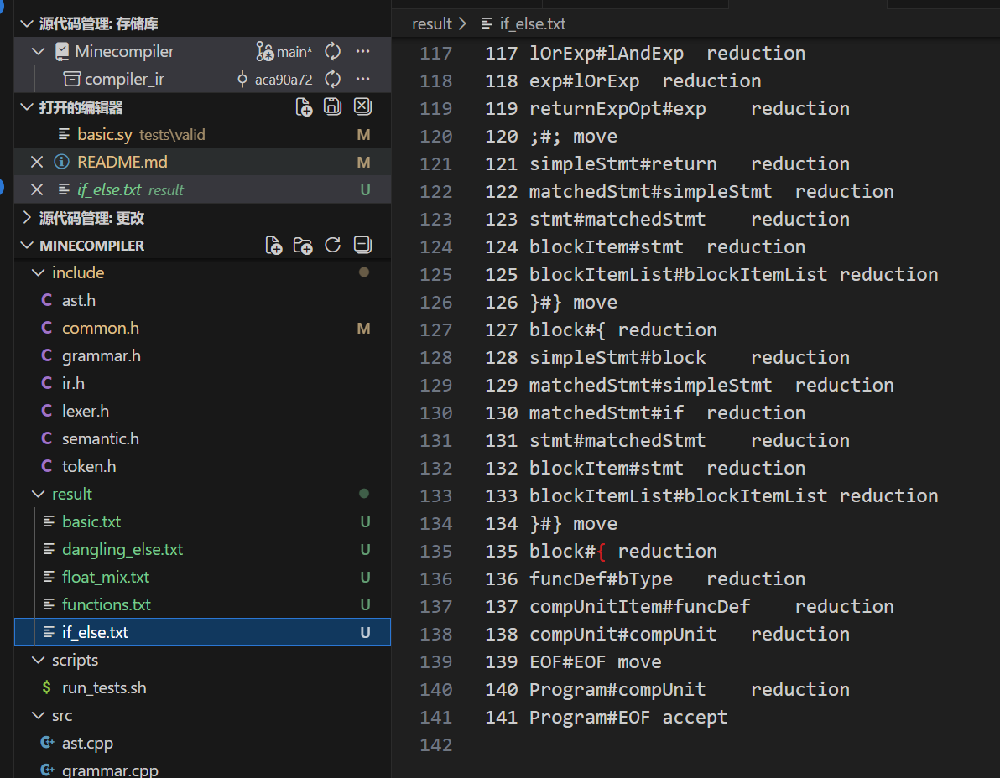

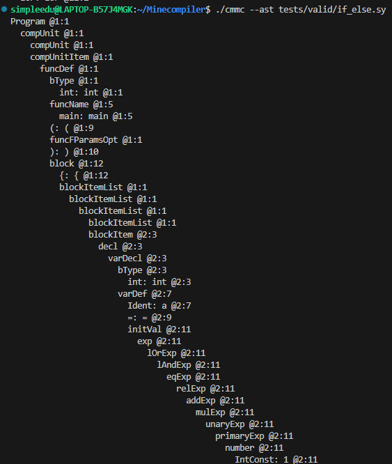

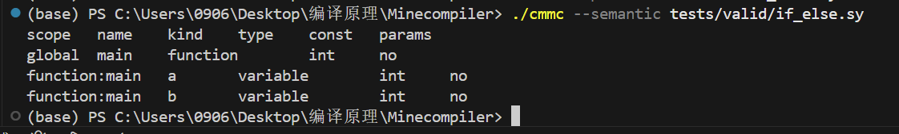

### 3.4 `dangling_else.sy`：悬空 else 测试

测试目标是验证经典 dangling else 二义性处理，确保 `else` 与最近的未匹配 `if` 正确绑定。

编译器通过 `matchedStmt / unmatchedStmt` 文法改写消除二义性，SLR 分析路径合法，最终 `accept`。AST 中多层嵌套 `if` 结构归属明确，语义分析中嵌套作用域合法。

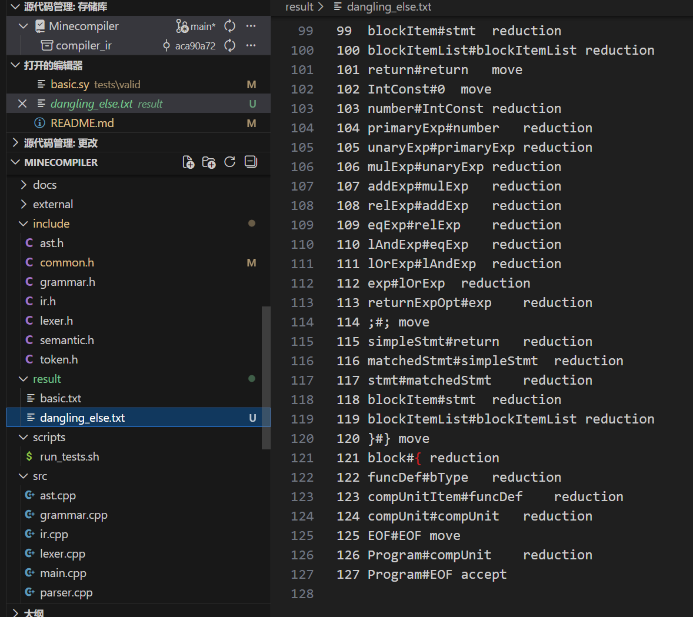

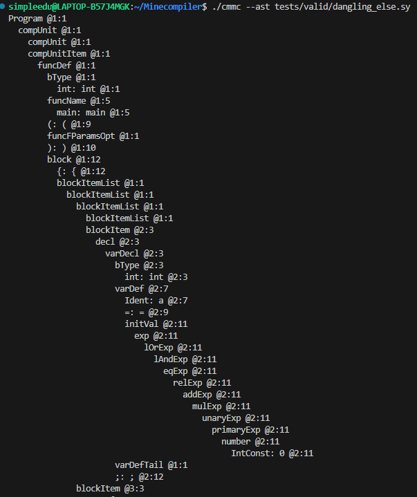

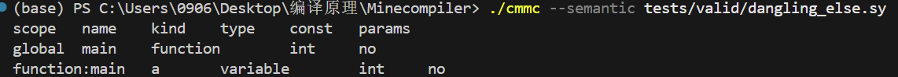

### 3.5 `float_mix.sy`：浮点与类型转换测试

测试目标是验证 `float` 类型声明、浮点运算、`int -> float` 隐式转换、浮点函数参数和返回值。

语法分析能够识别 `float` 关键字、浮点常量、浮点声明和函数调用。AST 中包含正确的浮点类型节点、表达式节点和调用节点。语义分析支持 `float` 类型，参数和返回值类型兼容性检查通过。

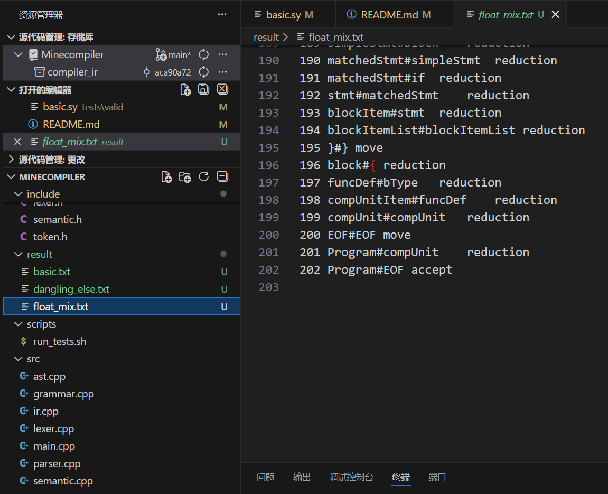

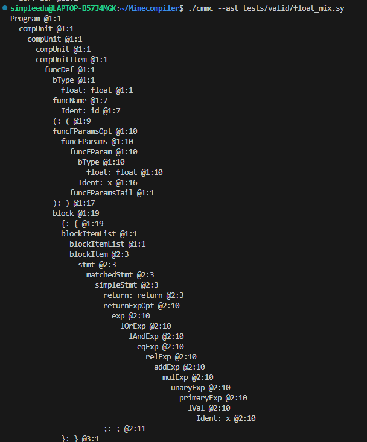

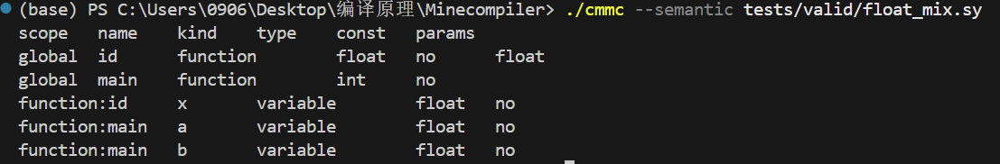

### 3.6 `functions.sy`：函数定义、调用与参数测试

测试目标是验证多参数函数定义、函数调用、实参与形参匹配、参数传递和返回值传递。

语法分析能够正确归约 `funcFParam`、`funcDef` 和 call 表达式。AST 中函数定义、参数列表、函数调用和返回语句结构完整。语义分析能够记录函数参数列表，并检查函数重复定义、参数个数、参数类型和作用域隔离。

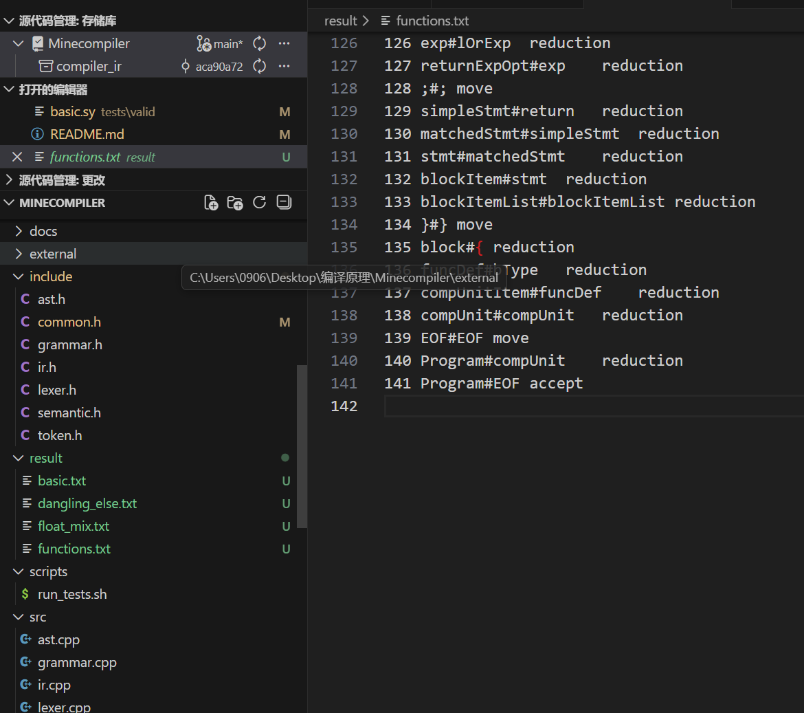

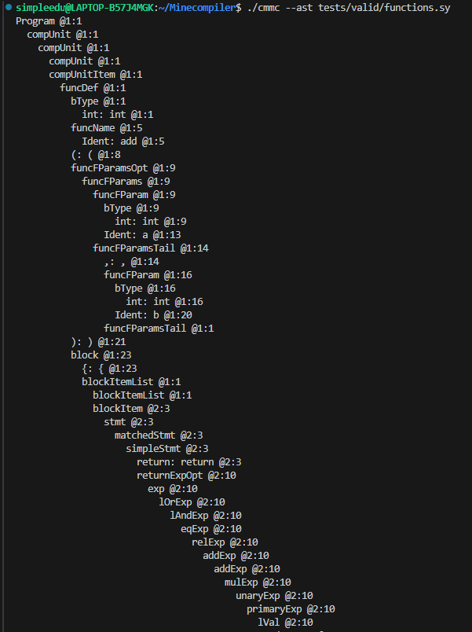

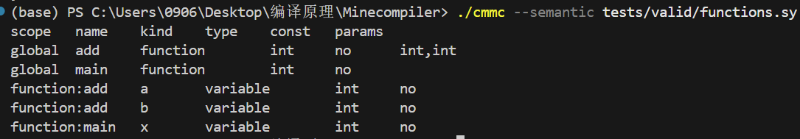

### 3.7 `nested_calls.sy`：函数嵌套调用测试

测试目标是验证多层嵌套函数调用、函数返回值作为实参传递、无参函数调用、跨函数作用域隔离和参数类型检查。

`f(f(1))` 能够按照 `unaryExp -> exp -> returnExpOpt` 逐级归约，所有表达式、语句和函数定义均正常通过 SLR 分析。AST 能够表示多层函数调用关系。语义分析正确识别全局函数 `f`、`g`、`main` 以及 `f` 的局部参数 `x`，不会把内层调用参数错误计入外层调用。

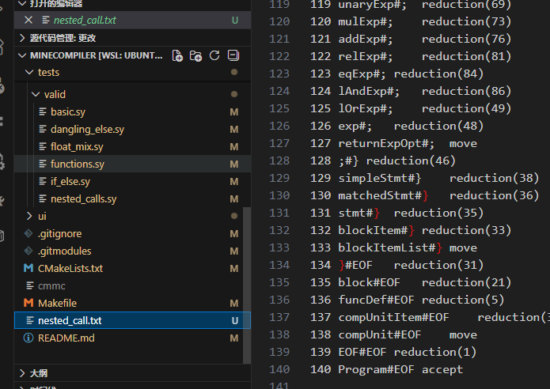

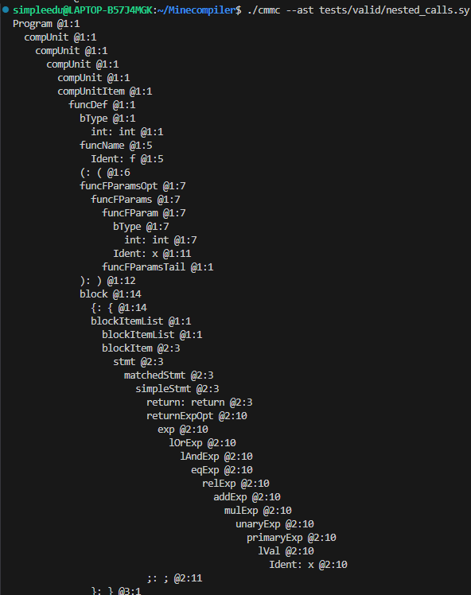

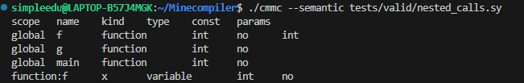

### 3.8 Valid 测试结论

`tests/valid` 中所有正确程序均通过 SLR 语法分析、AST 构造和语义检查。测试覆盖基础声明与表达式、分支控制流、dangling else、浮点扩展、函数定义调用和嵌套调用，说明前端主流程在合法程序上表现稳定。

## 4. Invalid 错误程序测试

### 4.1 测试结果总览

| 测试文件 | 错误类型 | 语法分析结果 | 语义分析结果 |
| --- | --- | --- | --- |
| `tests/invalid/syntax.sy` | 语法错误 | 失败，成功报错 | 未进入语义阶段 |
| `tests/invalid/call_args.sy` | 函数实参数量错误 | 通过 | 失败，成功报错 |
| `tests/invalid/const_assign.sy` | const 常量赋值错误 | 通过 | 失败，成功报错 |
| `tests/invalid/semantic.sy` | 未定义变量错误 | 通过 | 失败，成功报错 |
| `tests/invalid/type_return.sy` | 返回值类型错误 | 通过 | 失败，成功报错 |

### 4.2 `syntax.sy`：语法错误测试

测试命令：

```bash
./cmmc --parse tests/invalid/syntax.sy
```

测试结果为：

```text
parser:1:11: unexpected token '{' in state 22
```

该样例中函数定义写成 `int main( {`，在 `main(` 后缺少右括号 `)`，导致语法分析器在第 1 行第 11 列读取 `{` 时无法继续 SLR 分析。编译器能够在 parser 阶段识别非法语法结构，并给出明确的错误位置。

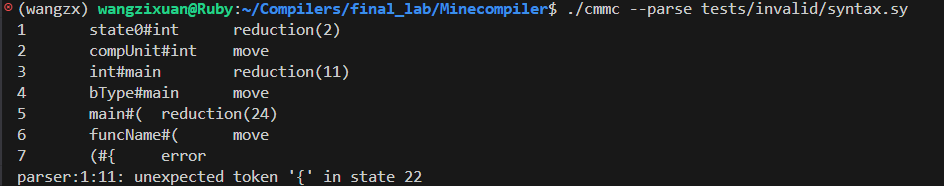

### 4.3 `call_args.sy`：函数参数数量错误测试

测试命令：

```bash
./cmmc --parse tests/invalid/call_args.sy
./cmmc --semantic tests/invalid/call_args.sy
```

语法分析通过，语义分析输出：

```text
semantic:6:10: function 'add' expects 2 argument(s), got 1
```

该样例定义 `int add(int a, int b)`，该函数需要两个参数，但在 `main` 中调用为 `return add(1);`，实参数量只有一个。程序语法结构正确，因此 parse 阶段通过；语义分析阶段检查函数调用参数数量时发现错误，并输出明确诊断。

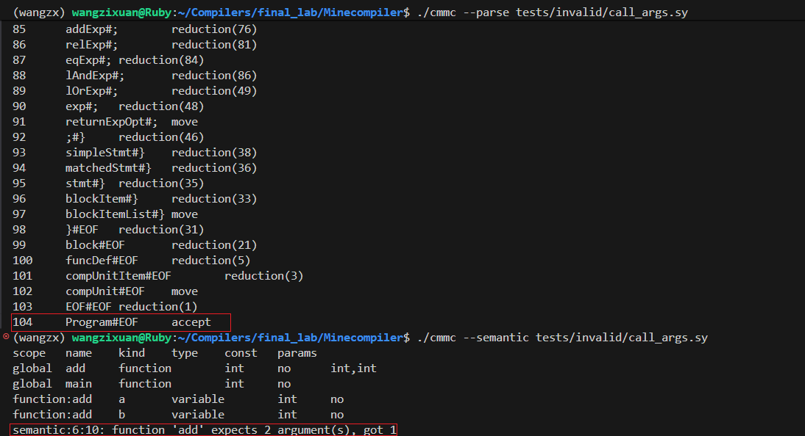

### 4.4 `const_assign.sy`：const 常量赋值错误测试

测试命令：

```bash
./cmmc --parse tests/invalid/const_assign.sy
./cmmc --semantic tests/invalid/const_assign.sy
```

语法分析通过，语义分析输出：

```text
semantic:4:3: cannot assign to const variable 'a'
```

该样例先声明全局常量 `const int a = 1;`，随后在 `main` 中执行 `a = 2;`。赋值语句本身语法合法，但违反 const 常量不可再次赋值的语义规则。语义分析器能够识别对常量变量 `a` 的非法赋值，并给出错误位置。

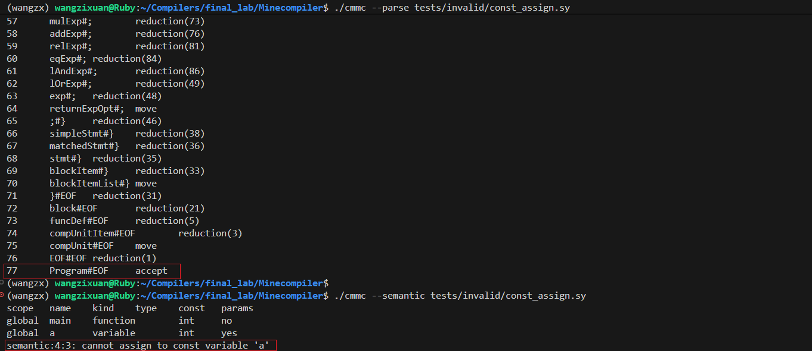

### 4.5 `semantic.sy`：未定义变量错误测试

测试命令：

```bash
./cmmc --parse tests/invalid/semantic.sy
./cmmc --semantic tests/invalid/semantic.sy
```

语法分析通过，语义分析输出：

```text
semantic:5:3: assignment to undefined variable 'b'
semantic:7:10: use of undefined variable 'b'
```

该样例在 `main` 函数中使用了未声明变量 `b`：

```c
b = a + 1;
return b;
```

由于变量 `b` 没有提前声明，语义分析器分别在赋值语句和 `return` 语句中检测到未定义变量错误。该样例说明符号表查询和多错误诊断逻辑有效。

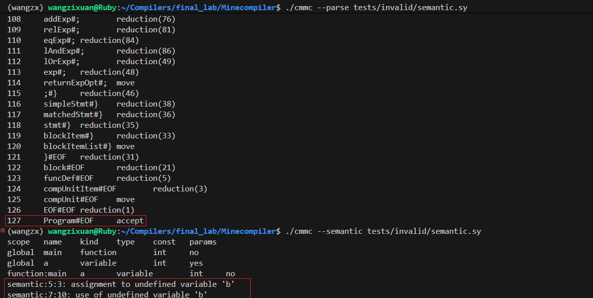

### 4.6 `type_return.sy`：返回值类型错误测试

测试命令：

```bash
./cmmc --parse tests/invalid/type_return.sy
./cmmc --semantic tests/invalid/type_return.sy
```

语法分析通过，语义分析输出：

```text
semantic:3:3: return type float does not match int
```

该样例中 `main` 函数返回类型为 `int`，但函数体内声明了 `float` 类型变量并直接返回：

```c
float a = 1.5;
return a;
```

返回表达式类型为 `float`，与函数声明返回类型 `int` 不匹配。语义分析器能够识别返回类型错误，并输出对应诊断信息。

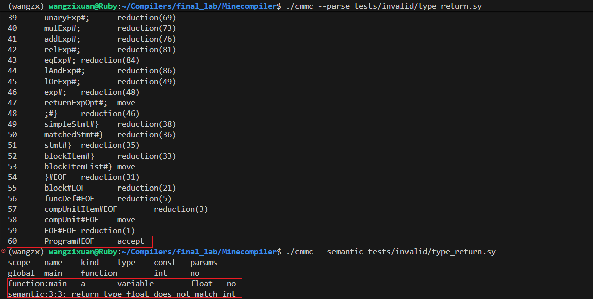

### 4.7 Invalid 测试结论

本次对 `tests/invalid` 目录下的错误样例进行了测试，结果表明：

1. 对于 `syntax.sy` 这类语法错误样例，编译器能够在 SLR 语法分析阶段发现错误，并输出 parser 错误信息。
2. 对于语法正确但语义错误的样例，编译器能够进入语义分析阶段，并准确识别函数参数数量错误、const 常量赋值错误、未定义变量错误和返回值类型错误。
3. 所有 invalid 测试样例均被正确判定为错误程序，说明编译器能够有效区分语法错误和语义错误，并输出对应诊断信息。

## 5. IR 生成测试

### 5.1 测试结果总览

| 测试文件 | 测试内容 | 测试结果 |
| --- | --- | --- |
| `tests/ir/const_expr.sy` | 全局整数常量表达式 | 通过 |
| `tests/ir/consts.sy` | 全局整数常量 | 通过 |
| `tests/ir/float_call_cast.sy` | 浮点函数定义与调用、类型转换 | 通过 |
| `tests/ir/float_const_expr.sy` | 浮点常量表达式 | 通过 |
| `tests/ir/float_global.sy` | 浮点全局变量 | 通过 |
| `tests/ir/float_init_expr.sy` | 浮点常量初始化 | 通过 |
| `tests/ir/float_local_const.sy` | 局部浮点常量 | 通过 |
| `tests/ir/functions.sy` | 整数函数定义与调用 | 通过 |
| `tests/ir/if_else.sy` | 条件分支 | 通过 |
| `tests/ir/simple.sy` | 基本运算 | 通过 |

### 5.2 `const_expr.sy`：全局整数常量表达式

测试命令：

```bash
./cmmc --ir tests/ir/const_expr.sy
```

IR 生成器正确处理全局常量定义，并在编译期对 `a + 1` 进行常量折叠，生成 `@b = constant i32 4`。`main` 函数加载 `@b` 并返回，实际输出与预期一致。

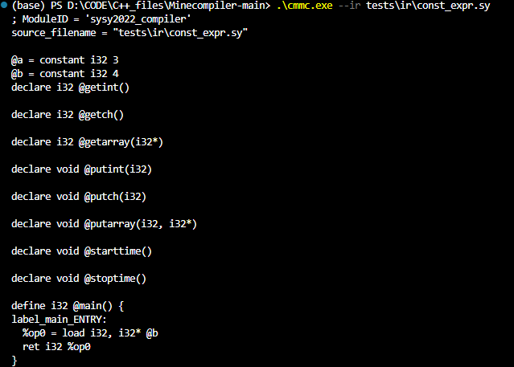

### 5.3 `consts.sy`：全局整数常量

测试命令：

```bash
./cmmc --ir tests/ir/consts.sy
```

该用例包含全局常量 `base = 7` 和局部变量 `delta = 5`。生成 IR 中，`@base` 正确定义为 `constant i32 7`，局部变量通过 `alloca` 分配空间并初始化，随后执行整数加法并返回。

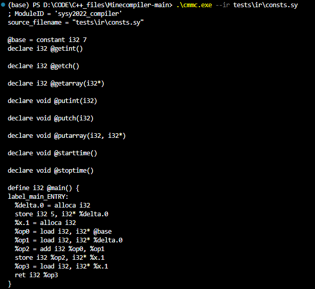

### 5.4 `float_call_cast.sy`：浮点函数定义与调用

测试命令：

```bash
./cmmc --ir tests/ir/float_call_cast.sy
```

该用例定义 `float f(float x)`，并在 `g` 中调用 `f(1)`。生成 IR 在调用点插入 `sitofp i32 1 to float`，再将转换后的值作为 `float` 参数传递给 `@f`，验证了 `int -> float` 隐式类型提升。

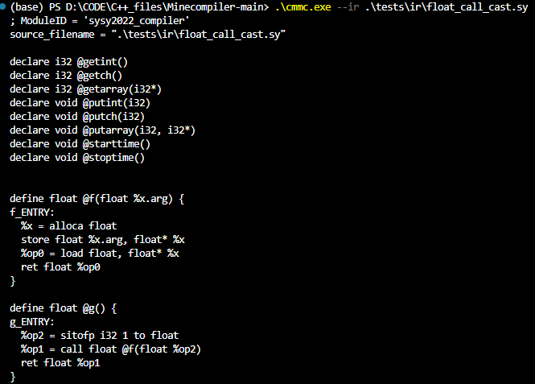

### 5.5 `float_const_expr.sy`：浮点常量表达式

测试命令：

```bash
./cmmc --ir tests/ir/float_const_expr.sy
```

该用例定义全局常量 `a = 3`、`b = a + 1`，函数 `f` 返回 `b + 0.5`。生成 IR 中，`b` 被折叠为 `4`，函数体内加载整数 `b` 后通过 `sitofp` 转换为浮点，再执行 `fadd`。

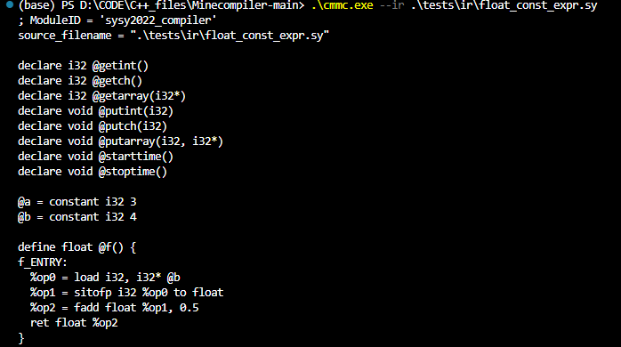

### 5.6 `float_global.sy`：浮点全局变量

测试命令：

```bash
./cmmc --ir tests/ir/float_global.sy
```

该用例定义全局浮点变量 `g = 1.5`，`main` 返回 `g > 0.0` 的比较结果。生成 IR 中，`@g` 被正确初始化为浮点全局变量，函数体内加载 `@g`，执行 `fcmp ogt` 比较，并通过 `zext` 扩展为 `i32` 返回。

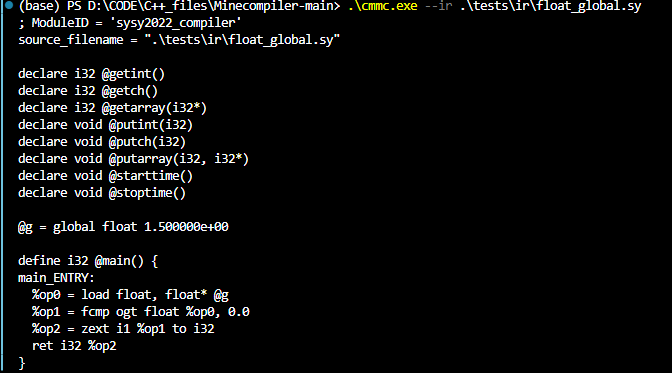

### 5.7 `float_init_expr.sy`：浮点常量初始化

测试命令：

```bash
./cmmc --ir tests/ir/float_init_expr.sy
```

该用例包含整数常量 `a = 3`、浮点常量 `h = a + 0.5` 和浮点全局变量 `g = 1`。生成 IR 中，`@h = constant float 3.500000e+00`，`@g = global float 1.000000e+00`，说明全局 float 初始化和常量表达式求值均正确。

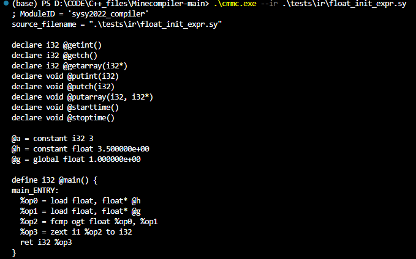

### 5.8 `float_local_const.sy`：局部浮点常量

测试命令：

```bash
./cmmc --ir tests/ir/float_local_const.sy
```

该用例在函数内声明局部常量 `c = 2`，返回 `c + 1.0`。生成 IR 中，局部常量通过 `alloca i32` 分配并初始化，加载后通过 `sitofp` 转换为浮点，再与 `1.0` 执行 `fadd`。

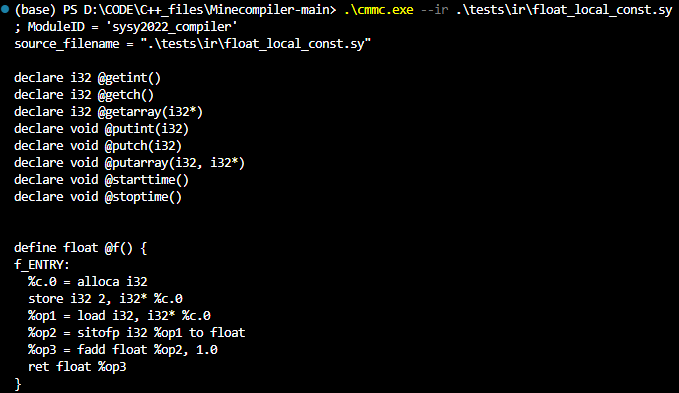

### 5.9 `functions.sy`：整数函数定义与调用

测试命令：

```bash
./cmmc --ir tests/ir/functions.sy
```

该用例定义 `add(i32 a, i32 b)` 并在 `main` 中调用。生成 IR 中，函数参数通过 `alloca` 存储到局部变量，执行加法后返回；`main` 生成 `call i32 @add(i32 10, i32 20)` 指令，参数传递和返回值处理正确。

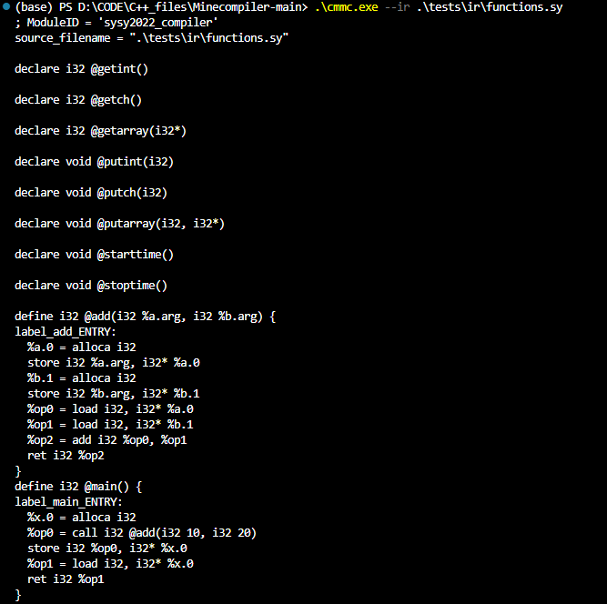

### 5.10 `if_else.sy`：条件分支

测试命令：

```bash
./cmmc --ir tests/ir/if_else.sy
```

该用例在 `main` 中定义局部变量 `a = 3`，若 `a > 2` 返回 `1`，否则返回 `0`。生成 IR 中包含比较指令、条件跳转和 then/else 基本块，控制流结构符合源程序语义。

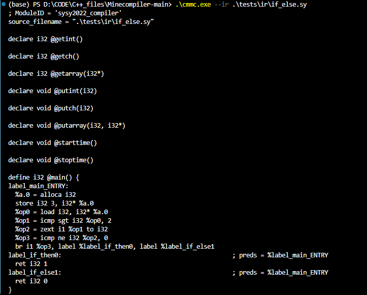

### 5.11 `simple.sy`：基本运算

测试命令：

```bash
./cmmc --ir tests/ir/simple.sy
```

该用例定义全局变量 `a`，在 `main` 中计算 `x * y + 2` 并写回 `a`。生成 IR 中包含全局变量读写、局部变量分配、乘法和加法指令，最终加载 `a` 并返回。

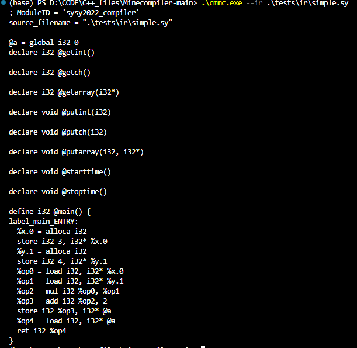

### 5.12 IR 测试结论

IR 测试覆盖全局常量表达式、局部变量和全局变量、函数调用、条件分支、基本算术运算、浮点全局变量、浮点常量初始化、局部 const 和 `int -> float` 类型转换。所有用例均输出符合预期的 LLVM IR，并通过自动化测试脚本校验。

## 6. 总体结论

本次测试覆盖了编译器前端从源程序输入到 LLVM IR 输出的完整链路：

1. 词法阶段能够识别合法 token，支持关键字大小写不敏感、注释过滤、最长匹配和非法字符恢复。
2. 语法阶段能够自动构造 SLR 分析过程，对正确程序输出 `accept`，对错误程序输出带位置的 parser 诊断。
3. AST 构造能够保持程序结构层次，支持声明、函数、表达式、分支和调用节点。
4. 语义阶段能够检查作用域、未定义变量、const 赋值、函数参数、返回值类型和嵌套调用。
5. IR 阶段能够生成全局变量、局部变量、函数调用、条件分支、整型表达式和浮点扩展相关 LLVM IR。

综上，Minecompiler 当前测试用例均已通过，项目实现满足 C-- 编译器前端对词法分析、语法分析、语义分析和中间代码生成的核心要求，并具备较好的错误诊断和回归测试能力。
